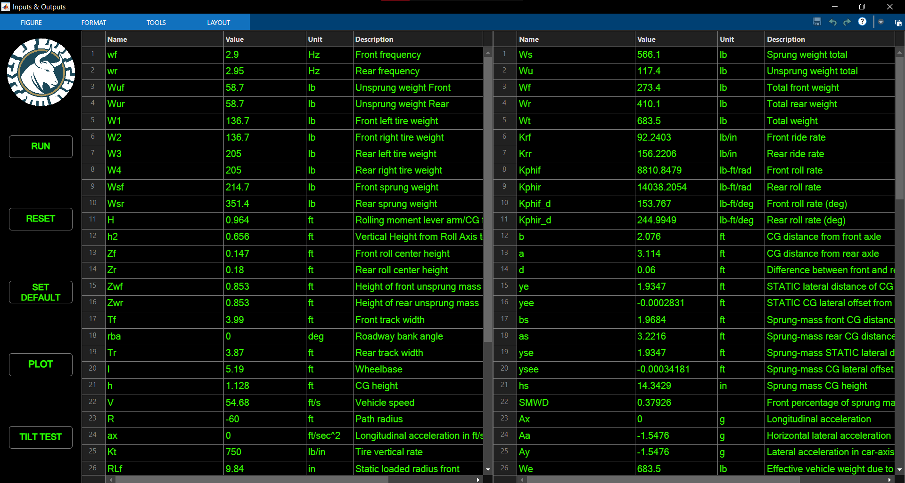

# ride-n-rollin
Interactive MATLAB-based vehicle dynamics analysis tool developed for a Formula Student car.

### Main interface

The tool allows vehicle parameters to be modified through a graphical interface and automatically calculates key suspension, load transfer, roll, wheel load and aerodynamic quantities, while allowing plotting for every input variable with any output. The equations are taken from Milliken and Millikens book Race Car Vehicle Dynamics chapters 16 and 18. 

## Features
- Interactive MATLAB graphical interface with editable vehicle parameters
- Suspension ride rate and roll rate calculations
- Individual wheel load calculations during cornering
- Lateral and longitudinal load transfer analysis
- Vehicle and sprung mass centre of gravity calculations
- Spring rate and wheel rate calculations
- Roll gradient and required roll stiffness analysis
- Aerodynamic load and rolling moment calculations
- Parameter sweep plots for analysing input output relationships
- Formula Student tilt test check
- Custom default vehicle configurations

## Use
Pretty simple, when you run the code the default values will be put into the inputs side (left) and the outputs will be on the right. To change the data to your specific configuration/setup, just click on the inputs to change them. After you are done, press SET DEFAULT and the new defaults will be updated on the code so you don't lose them ever. If you change something and want to see the different outputs press RUN, and if you want to return to your defaults click RESET. If you want to plot any of the input with the output variables, click PLOT and choose the variables you want. For obvious reasons you can only plot an input variable with an output variable. If you want to change the values that the plots sweep, then you'll have to go into the code and do it, i was going to make that but my f@ck@ss team decided to go and f@ck itself all over and i had to leave. Might do it in the future. Finally, you can clickon the tilt test to get a VERY SIMPLE calculation of if you would pass the tilt test. I repeat, simple, therefore not reliable. its literally like a middle school equation. Might fix that in the future. Also, excuse the memes in the tilt test, i was going insane.
And one last thing, the photo in the far left corner is for you to put the logo of your team or idk f@cking p0rn to look at i have no idea. My team's logo used to be there, but F@CK them b1tches i aint advertising your @ss.

## Jumpscare warning
Also when the wheel loads are enough for the car to turn over (in greek τουμπάρει (pronunciation toombari)) a greek meme sound plays of a man screaming "WOOOOOAH YOULL TURN THE CAR OVER" in greek. Just saying this so it doesnt jumpscare anyone.
